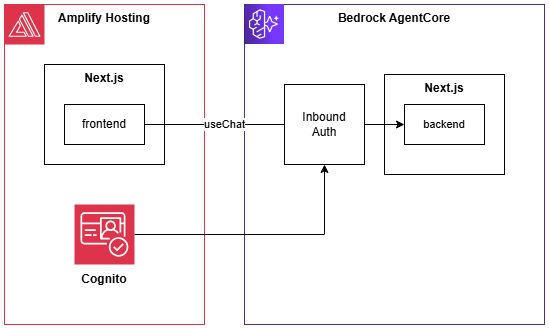
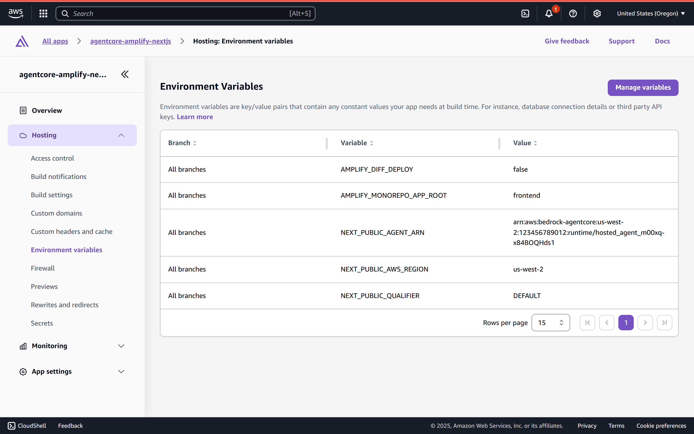

# agentcore-amplify-nextjs

A sample application that deploys an AI app built with Next.js and AI SDK to Amplify and Bedrock AgentCore.



## Deployment Steps

### Deploy frontend to Amplify

1. Open the Amplify Management Console and click "Create new app".
1. Select GitHub.
1. Select your repository. Check "My app is a monorepo" and enter "frontend" in the Monorepo root directory field.
1. Proceed through the wizard and deploy.

After deployment, note the Amplify User Pool ID and Client ID that are created.

### Deploy backend to AgentCore

Clone the source and run `build_image.sh` in the backend directory. This will containerize the backend and push it to ECR.

Create an AgentCore Runtime in the Management Console.

1. Open the AgentCore Management Console and select the "Agent Runtime" menu.
1. Click "Host agent".
1. Enter the agent runtime name and select the Docker image.
1. Open the Inbound Auth section:

    - Protocol: HTTP
    - Inbound Auth Type: Use JSON Web Tokens (JWT)
    - JWT schema configuration: Use existing Identity provider configurations
    - Discovery URL: `https://cognito-idp.{REGION}.amazonaws.com/{COGNITO_USERPOOL_ID}/.well-known/openid-configuration`
    - Allowed clients: Cognito Client ID
1. Click "Host agent".

### Add AgentCore destination to Amplify

Register the AgentCore destination information to the previously deployed Amplify.

- NEXT_PUBLIC_AGENT_ARN: arn:aws:bedrock-agentcore:{REGION}:{AWS_ACCOUNT_ID}:runtime/{RUNTIME_NAME}
- NEXT_PUBLIC_AWS_REGION: REGION
- NEXT_PUBLIC_QUALIFIER: DEFAULT



## Local Development

Start the backend. Uses port 8080.

```shell
# in backend directory
npm i
npm run dev
```

Start the frontend. Uses port 3000.

```shell
# in frontend directory
npm i
npm run dev
```

Access `http://localhost:3000`.
